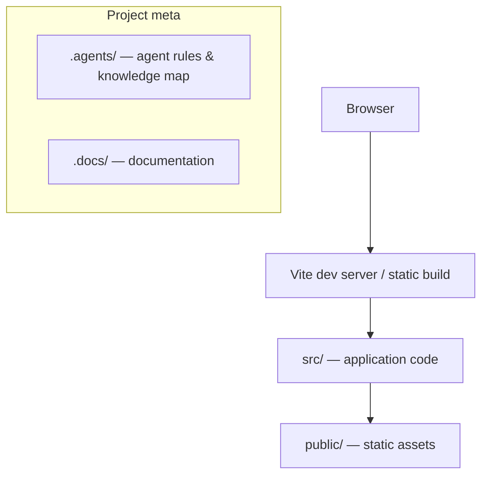

# Knowledge Map — neptr-cli

The single starting point for understanding this codebase: where everything lives and
which files matter most. **Agents: read this before your first change in a session.
Everyone: update it whenever project structure changes.** Last updated: 2026-07-07.

## Documentation index

| Document | What it answers |
| --- | --- |
| [AI_INSTRUCTIONS.md](AI_INSTRUCTIONS.md) | Entry point for AI agents: workflow, before/during/after a task |
| [CONSTITUTION.md](CONSTITUTION.md) | Non-negotiable principles for agents |
| [../.docs/environment.md](../.docs/environment.md) | Prerequisites, commands, and env vars to run this project |
| [../.docs/module-map.md](../.docs/module-map.md) | Where each type of component lives inside `src/` |
| [../.docs/REPO_MAP.md](../.docs/REPO_MAP.md) | Auto-generated index of every `src/` file and its exports (`neptr index`) |
| [../.docs/architecture/ARCHITECTURE.md](../.docs/architecture/ARCHITECTURE.md) | Stack, module boundaries, data flow |
| [../.docs/architecture/adr/](../.docs/architecture/adr/) | Architectural decision records (why things are the way they are) |
| [../.docs/documents/](../.docs/documents/) | User-provided files and documents |
| [../.docs/feature/](../.docs/feature/) | In-flight feature workspaces (plan/tasks/status/notes per feature) |
| [../README.md](../README.md) | Human-facing overview: what this project is, how to run it |

## Folder map

| Path | Purpose |
| --- | --- |
<!-- neptr:foldermap:start -->
| `src/` | Application source (Vite `vanilla-ts` layout) — see [../.docs/module-map.md](../.docs/module-map.md) |
| `public/` | Static assets served as-is |
| `.agents/` | Agent rules and this knowledge map (you are here) |
| `.agents/skills/` | Installed skills.sh skills |
| `.docs/` | Project documentation: environment, module map, architecture, documents, features |
| `.docs/architecture/` | Architecture overview and ADRs |
| `.docs/architecture/adr/` | Numbered architectural decision records |
| `.docs/documents/` | Files and documents provided by the user |
| `.docs/feature/` | Feature workspaces: plan/tasks/status/notes per feature |
| `.cursor/` | Cursor rules |
<!-- neptr:foldermap:end -->

> The rows between the markers above are regenerated by `neptr index` from the folders
> that actually exist. Prose outside the markers is yours to keep. Generated and tool
> folders (`node_modules/`, `dist/`) don't count.

## Key files

| File | Role |
| --- | --- |
<!-- neptr:keyfiles:start -->
| [../index.html](../index.html) | HTML entry — Vite serves and builds from here |
| `src/` main module | Application bootstrap (see the Vite `vanilla-ts` layout) |
| [../package.json](../package.json) | Dependencies and npm scripts |
| `.env` (gitignored) | Environment variables — document each in [../.docs/environment.md](../.docs/environment.md) |
| [../.env.example](../.env.example) | Committed template for `.env`; keep every variable in sync here |
<!-- neptr:keyfiles:end -->

<!-- The rows between the neptr:keyfiles markers are regenerated by `neptr index`.
As the project grows, add the source files an agent will most often need: state
stores, API clients, routers, shared utilities. Rule of thumb: if you had to hunt for a
file more than once, it belongs here. -->

## Key concepts

<!-- As the project grows, list the 5-10 concepts someone must understand to work here,
each linking to where it lives in code. Seeded empty by NEPTR. -->

- _None recorded yet — add the first one when the first real feature lands._

## Architecture at a glance

> Replace this diagram as real architecture emerges (components, state, services, APIs).
> Details belong in [../.docs/architecture/ARCHITECTURE.md](../.docs/architecture/ARCHITECTURE.md); this is the
> 10-second version.
