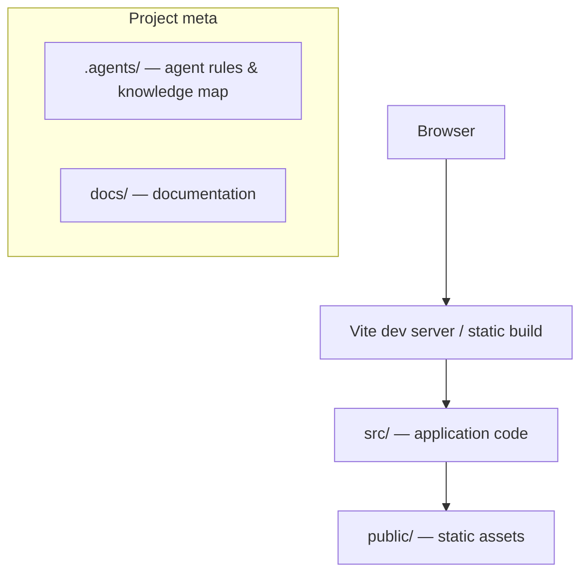

# Knowledge Map — {{projectName}}

The single starting point for understanding this codebase: where everything lives.
**Agents: read this before your first change in a session. Everyone: update it —
together with [INDEX.md](INDEX.md) — whenever project structure changes.**
Last updated: {{date}}.

## Documentation index

| Document | What it answers |
| --- | --- |
| [AI_INSTRUCTIONS.md](AI_INSTRUCTIONS.md) | Entry point for AI agents: workflow, before/during/after a task |
| [CONSTITUTION.md](CONSTITUTION.md) | Non-negotiable principles for agents |
| [INDEX.md](INDEX.md) | Direct links to the important files in this repo |
| [../docs/COMMANDS.md](../docs/COMMANDS.md) | Commands and scripts for building, running, testing |
| [../docs/architecture/ARCHITECTURE.md](../docs/architecture/ARCHITECTURE.md) | Stack, module boundaries, data flow |
| [../docs/architecture/adr/](../docs/architecture/adr/) | Architectural decision records + specs (why things are the way they are) |
| [../docs/domain/DOMAIN_DOCUMENTATION.md](../docs/domain/DOMAIN_DOCUMENTATION.md) | Doc granularity levels + when to update what |
| [../docs/domain/DOMAIN_INSTRUCTIONS.md](../docs/domain/DOMAIN_INSTRUCTIONS.md) | Domain glossary, rules, and invariants |
| [../docs/files/](../docs/files/) | User-provided files and documents |
| [../README.md](../README.md) | Human-facing overview: what this project is, how to run it |

## Folder map

| Path | Purpose |
| --- | --- |
| `src/` | Application source (Vite `{{template}}` layout) |
| `public/` | Static assets served as-is |
| `.agents/` | Agent rules, knowledge map, index, skills (you are here) |
| `.agents/features/` | Feature workspaces: plan/tasks/status/notes per feature |
| `docs/` | Project documentation: commands, architecture, domain, user files |
| `docs/architecture/` | Architecture overview, specs, and ADRs |
| `docs/architecture/adr/` | Numbered architectural decision records |
| `docs/domain/` | Documentation guide and domain instructions |
| `docs/files/` | Files and documents provided by the user |
{{extraFolderRows}}

> Keep this table in sync with reality. A folder that exists but isn't listed here —
> or vice versa — means this map is broken.

## Key concepts

<!-- As the project grows, list the 5-10 concepts someone must understand to work here,
each linking to where it lives in code. Seeded empty by Beemo. -->

- _None recorded yet — add the first one when the first real feature lands._

## Architecture at a glance

> Replace this diagram as real architecture emerges (components, state, services, APIs).
> Details belong in [../docs/architecture/ARCHITECTURE.md](../docs/architecture/ARCHITECTURE.md); this is the
> 10-second version.
